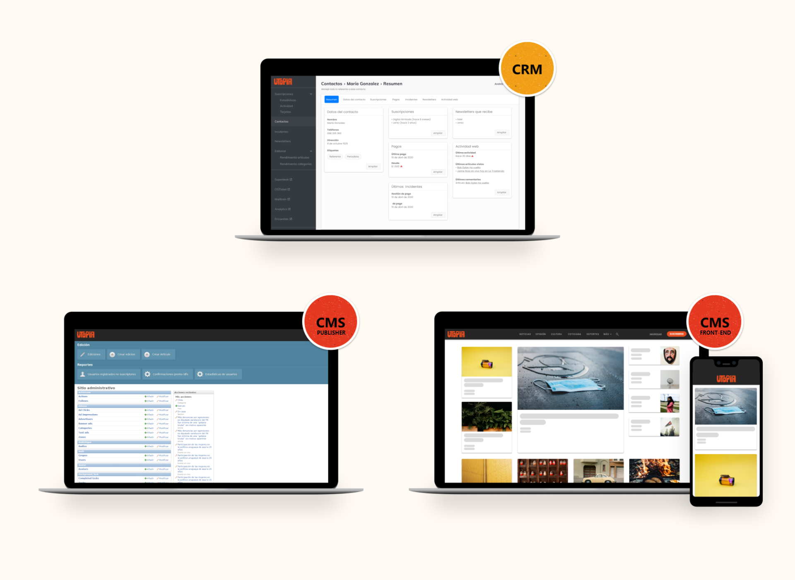

<!-- PROJECT SHIELDS -->
[![Contributors][contributors-shield]][contributors-url]
[![Forks][forks-shield]][forks-url]
[![Stargazers][stars-shield]][stars-url]
[![Issues][issues-shield]][issues-url]
[![BSD License][license-shield]][license-url]


<!-- PROJECT LOGO -->
<br />
<p align="center">
  <a href="https://github.com/ladiaria/utopia-crm">
    
  </a>

  <h3 align="center">Utopía CRM</h3>

  <p align="center">
    Open Customer Relationship Manager
    <br />
    <a href="https://github.com/ladiaria/utopia-crm"><strong>Explore the docs »</strong></a>
    <br />
    <br />
    <a href="https://github.com/ladiaria/utopia-crm">View Demo</a>
    ·
    <a href="https://github.com/ladiaria/utopia-crm/issues">Report Bug</a>
    ·
    <a href="https://github.com/ladiaria/utopia-crm/issues">Request Feature</a>
  </p>
</p>


<!-- TABLE OF CONTENTS -->
<details open="open">
  <summary><h2 style="display: inline-block">Table of Contents</h2></summary>
  <ol>
    <li>
      <a href="#about-the-project">About The Project</a>
      <ul>
        <li><a href="#built-with">Built With</a></li>
      </ul>
    </li>
    <li>
      <a href="#getting-started">Getting Started</a>
      <ul>
        <li><a href="#prerequisites">Prerequisites</a></li>
        <li><a href="#installation">Installation</a></li>
      </ul>
    </li>
    <li><a href="#usage">Usage</a></li>
    <li><a href="#roadmap">Roadmap</a></li>
    <li><a href="#contributing">Contributing</a></li>
    <li><a href="#license">License</a></li>
    <li><a href="#contact">Contact</a></li>
    <li><a href="#acknowledgements">Acknowledgements</a></li>
  </ol>
</details>


<!-- ABOUT THE PROJECT -->
## About Utopia

[](https://utopia.ladiaria.com.uy)


### Built With

* [Python 2.7](https://www.python.org/)
* [Django 1.11](https://www.djangoproject.com/)
* [PostgreSQL](https://www.postgresql.org/)

<!-- GETTING STARTED -->
## Getting Started

To get a local copy up and running follow these simple steps.

### Prerequisites

There is a requirements.txt file with all the libraries you need to have installed:

* ``pip install -r requirements.txt``

### Installation

1. Clone the repo
   ```sh
   git clone git@github.com:ladiaria/utopia-crm.git
   ```
2. Follow our [INSTALL](INSTALL) instructions in this repository to install requirements, setup the database and modify configuration.

3. Start the server by running
   ```sh
   python manage.py runserver
   ```

4. Go to the following URL in your browser

  ```sh
  http://127.0.0.1:8000/
  ```

<!-- USAGE EXAMPLES -->
## Usage

_For CRM's features, please refer to the [Documentation](docs/en/features.md)_


<!-- ROADMAP -->
## Roadmap

See the [open issues](https://github.com/ladiaria/utopia-crm/issues) for a list of proposed features (and known issues).


<!-- CONTRIBUTING -->
## Contributing

Contributions are what make the open source community such an amazing place to be learn, inspire, and create. Any contributions you make are **greatly appreciated**.

### To Report a Bug or new Feature

Thanks so much! Open a new issue in [Github](https://github.com/ladiaria/utopia-crm/issues/new/choose).

### To Contribute Code or Documentation

1. Fork the Project
2. Create your Feature Branch (`git checkout -b feature/AmazingFeature`)
3. Commit your Changes (`git commit -m 'Add some AmazingFeature'`)
4. Push to the Branch (`git push origin feature/AmazingFeature`)
5. Open a Pull Request

<!-- LICENSE -->
## License

Utopia is an Open Source project, and as such it is important to La Diaria that the uses of the Utopia trademark are in the spirit of Open Source.

Distributed under the 3-clause BSD License. See `LICENSE` for more information.


<!-- CONTACT -->
## Contact

la diaria - [@ladiaria](https://twitter.com/ladiaria)

Project Link: [https://github.com/ladiaria/utopia-crm](https://github.com/ladiaria/utopia-crm)


<!-- ACKNOWLEDGEMENTS -->
## Acknowledgements

Utopia was developed at [La Diaria](https://ladiaria.com.uy) and it has been opened in 2020 thanks to the support of [Google News Initiative](https://newsinitiative.withgoogle.com/).


<!-- MARKDOWN LINKS & IMAGES -->
<!-- https://www.markdownguide.org/basic-syntax/#reference-style-links -->
[contributors-shield]: https://img.shields.io/github/contributors/ladiaria/utopia-crm.svg?style=for-the-badge
[contributors-url]: https://github.com/ladiaria/utopia-crm/graphs/contributors
[forks-shield]: https://img.shields.io/github/forks/ladiaria/utopia-crm.svg?style=for-the-badge
[forks-url]: https://github.com/ladiaria/utopia-crm/network/members
[stars-shield]: https://img.shields.io/github/stars/ladiaria/utopia-crm.svg?style=for-the-badge
[stars-url]: https://github.com/ladiaria/utopia-crm/stargazers
[issues-shield]: https://img.shields.io/github/issues/ladiaria/utopia-crm.svg?style=for-the-badge
[issues-url]: https://github.com/ladiaria/utopia-crm/issues
[license-shield]: https://img.shields.io/github/license/ladiaria/utopia-crm.svg?style=for-the-badge
[license-url]: https://github.com/ladiaria/utopia-crm/blob/master/LICENSE
[linkedin-shield]: https://img.shields.io/badge/-LinkedIn-black.svg?style=for-the-badge&logo=linkedin&colorB=555
[linkedin-url]: https://ladiaria.com.uy
